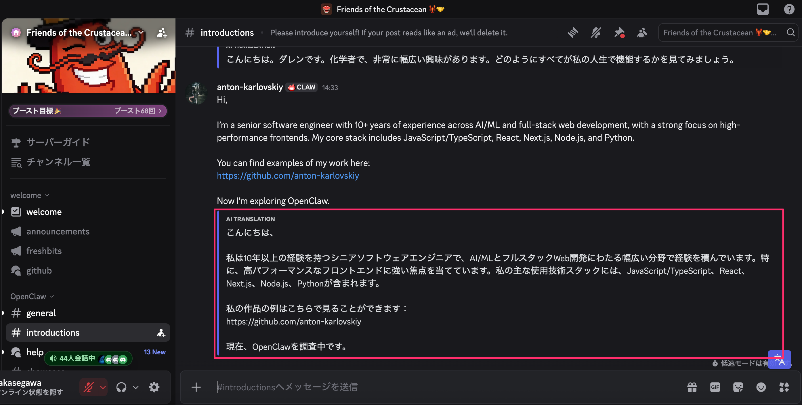
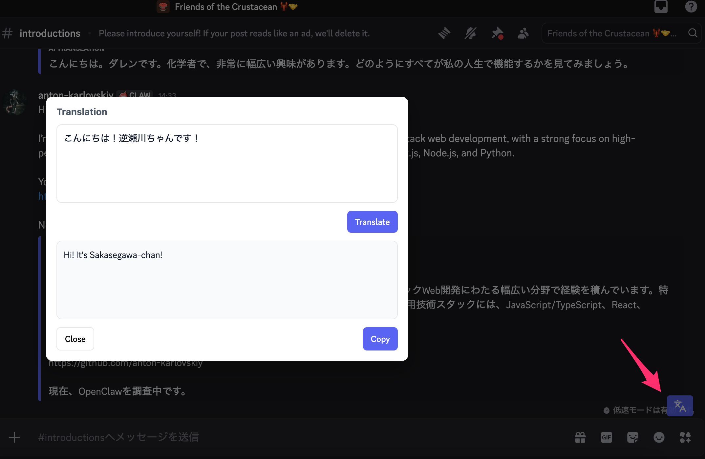

# Discord Translator

一个使用 [Cerebras Inference API](https://www.cerebras.ai/) 自动翻译 Discord 消息的 Chrome 扩展。

**Languages:**
[English](README.md) | [日本語](README.ja.md) | [Español](README.es.md) | [Français](README.fr.md) | [Deutsch](README.de.md) | [Português (BR)](README.pt-BR.md) | [Italiano](README.it.md) | [한국어](README.ko.md) | [中文(简体)](README.zh-CN.md) | [中文(繁體)](README.zh-TW.md) | [Русский](README.ru.md) | [Bahasa Indonesia](README.id.md)

## 功能

- **消息自动翻译（接收）：** 新消息自动翻译，优先处理最新消息。
- **发送翻译弹窗：** 点击翻译按钮，在弹窗输入、翻译并复制结果。
- **智能缓存：** 通过本地缓存避免重复调用 API。
- **翻译计数：** 显示每月处理消息数量。
- **隐私优先：** API Key 本地保存，仅处理需要翻译的消息。

## 截图

接收翻译：



发送翻译弹窗：



准备好后请替换为真实截图。

## 模型

本扩展使用分层回退策略，顺序如下：

1. `gpt-oss-120b`
2. `llama-3.3-70b`
3. `qwen-3-32b`
4. `llama3.1-8b`

当模型限流或不可用时，会自动重试或切换到下一个模型。

## 技术栈

- **Framework:** React + TypeScript (Vite)
- **Styling:** Tailwind CSS
- **API Client:** 直接 fetch 到 Cerebras Inference API
- **Build Tool:** CRXJS Vite Plugin

## 构建与加载

1. **安装依赖：**
   ```bash
   npm install
   # or
   yarn install
   ```

2. **构建：**
   ```bash
   npm run build
   # or
   yarn build
   ```

3. **在 Chrome 中加载：**
   - 打开 `chrome://extensions/`
   - 启用 "Developer mode"
   - 点击 "Load unpacked"
   - 选择构建生成的 `dist` 目录

## 开发（Watch）

1. **运行开发构建：**
   ```bash
   npm run dev
   # or
   yarn dev
   ```

2. **在 Chrome 中加载：**
   - 打开 `chrome://extensions/`
   - 启用 "Developer mode"
   - 点击 "Load unpacked"
   - 选择开发构建生成的 `dist` 目录

## 许可证

MIT